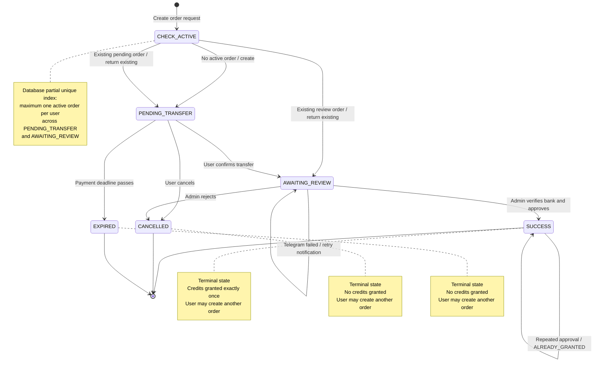

# Agent guidance

For UI work, read `.agent/design-system/nhuthungfoto/MASTER.md`.

# Payments model

Two distinct tables — do not conflate them:

- `payment_orders` = the **workflow** for the manual (bank-transfer / VietQR) flow. One row per purchase intent; tracks the order lifecycle (status, expiry, confirmation, Telegram, approval, resolution).
- `payments` = the **unified money ledger** across all providers (manual today, Stripe later). One row per confirmed money-in; `provider` identifies the method, `external_ref` is the unique provider reference. Linked to a manual order via the nullable `payments.payment_orders_id` FK (null for non-manual providers).

## Order status reads — always through the view

`payment_orders.status` is **physical**; lazy expiry leaves stale rows as `PENDING_TRANSFER` past their deadline. Reads must use `effective_status` from the `payment_orders_effective` view:

- User/UI/admin/status reads → `SELECT ... FROM payment_orders_effective` — never raw `payment_orders.status`.
- `effective_status` = `status`, except `PENDING_TRANSFER` past `expires_at` = `EXPIRED`.
- Writes keep going through the RPCs (`create_manual_payment_order`, lifecycle, grant) — they apply the deadline guard internally. Do not add new direct writes to `payment_orders`.

## payment_orders indexes (created in `20260902000001`)

| Index | Definition | Serves |
|---|---|---|
| `payment_orders_pkey` | `UNIQUE (id)` | fetch by known id + cross-user guard |
| `idx_payment_orders_active_user` | `UNIQUE (user_id) WHERE status IN ('PENDING_TRANSFER','AWAITING_REVIEW')` | **the law**: max 1 active order/user + `ON CONFLICT` arbiter in `create_manual_payment_order` |
| `idx_payment_orders_user_created` | `(user_id, created_at DESC)` | history list, newest first |
| `idx_payment_orders_user_status` | `(user_id, status)` | user orders filtered by status |
| `idx_payment_orders_review_queue` | `(confirmed_at) WHERE status='AWAITING_REVIEW'` | admin review queue, FIFO |

**Hard dependency:** `create_manual_payment_order`'s `ON CONFLICT (user_id) WHERE status IN (...)` matches `idx_payment_orders_active_user` byte-for-byte. Drop/reorder that index → RPC fails with `no unique or exclusion constraint matching the ON CONFLICT specification`. Never remove it.

# Payments state machine

