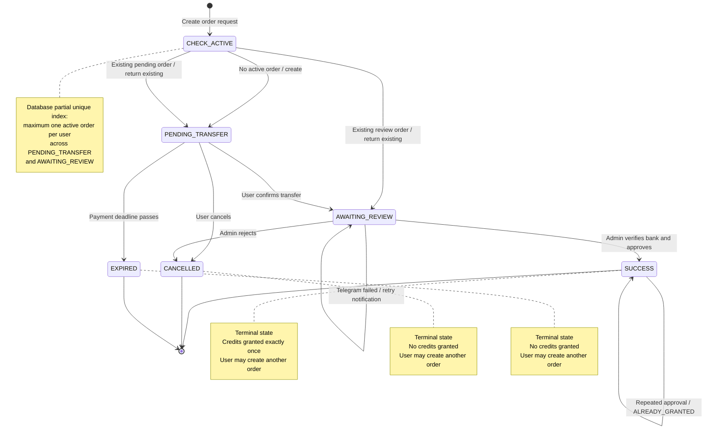

# Agent guidance

For UI work, read `docs/design`.
For the payments system, read `docs/payments/` (state machine, RPC reference, security posture); design rationale lives in `docs/adr/`.

Keep code comments short and to the point; add them only to briefly explain what something is or does.

# Payments model

Two distinct tables — do not conflate them:

- `payment_orders` = the **workflow** for the manual (bank-transfer / VietQR) flow. One row per purchase intent; tracks the order lifecycle (status, expiry, confirmation, Telegram, approval, resolution).
- `payments` = the **unified money ledger** across all providers (manual today, Stripe later). One row per confirmed money-in; `provider` identifies the method, `external_ref` is the unique provider reference. Linked to a manual order via the nullable `payments.payment_orders_id` FK (null for non-manual providers).

## Order status reads — always through the view

`payment_orders.status` is **physical**; lazy expiry leaves stale rows as `PENDING_TRANSFER` past their deadline. Reads must use `effective_status` from the `payment_orders_effective` view:

- User/UI/admin/status reads → `SELECT ... FROM payment_orders_effective` — never raw `payment_orders.status`.
- `effective_status` = `status`, except `PENDING_TRANSFER` past `expires_at` = `EXPIRED`.
- Writes keep going through the RPCs (`create_manual_payment_order`, lifecycle, grant) — they apply the deadline guard internally. Do not add new direct writes to `payment_orders`.
- **Enforced in code** (`backend/eslint.config.js`): raw `payment_orders` reads are banned (`no-restricted-syntax`), and `payment_orders_effective` reads must chain `.eq('user_id', …)` (`local/scope-order-read-by-user`) — `service_role` bypasses RLS, so the DB does not enforce ownership.

## SQL security posture — functions DEFINER, view INVOKER, only service_role gets to call

- **All RPCs = `SECURITY DEFINER`** (run as owner): the caller-independent **write gate**. The escalation is paid for with pinned `SET search_path = public, pg_temp`, `REVOKE EXECUTE FROM PUBLIC` (grant `service_role` only), and ownership/state guards inside the body.
- **`payment_orders_effective` = `security_invoker = true`** (runs as caller): it is a **read surface**, not a gate — no params, no guards. Owner rights would bypass RLS and leak every user's rows, so never remove `security_invoker`.
- Only `service_role` may call the RPCs or read the view; table DML is revoked from `anon`/`authenticated` and RLS is enabled with no policies (deny-all backstop). Ownership scoping is therefore application-level, not DB-enforced.

## payment_orders indexes (created in `20260902000001`)

| Index | Definition | Serves |
|---|---|---|
| `payment_orders_pkey` | `UNIQUE (id)` | fetch by known id + cross-user guard |
| `idx_payment_orders_active_user` | `UNIQUE (user_id) WHERE status IN ('PENDING_TRANSFER','AWAITING_REVIEW')` | **the law**: max 1 active order/user + `ON CONFLICT` arbiter in `create_manual_payment_order` |
| `idx_payment_orders_user_created` | `(user_id, created_at DESC)` | history list, newest first |
| `idx_payment_orders_user_status` | `(user_id, status)` | user orders filtered by status |
| `idx_payment_orders_review_queue` | `(confirmed_at) WHERE status='AWAITING_REVIEW'` | admin review queue, FIFO |

**Hard dependency:** `create_manual_payment_order`'s `ON CONFLICT (user_id) WHERE status IN (...)` matches `idx_payment_orders_active_user` byte-for-byte. Drop/reorder that index → RPC fails with `no unique or exclusion constraint matching the ON CONFLICT specification`. Never remove it.

# Payments state machine

## RPC transitions (implemented today)

Only three RPCs write `payment_orders`; all `service_role`-only, `SECURITY DEFINER`.

| RPC | Can move | Notes |
|---|---|---|
| `create_manual_payment_order` | — → `PENDING_TRANSFER`; `PENDING_TRANSFER` → `EXPIRED` | PENDING→EXPIRED = stale sweep for the caller (step 2), same `now()` as the view |
| `confirm_manual_payment_order` | `PENDING_TRANSFER` → `AWAITING_REVIEW` | past deadline: 409, **no write** (uncaught `RAISE` rolls back) |
| `cancel_manual_payment_order` | `PENDING_TRANSFER` → `CANCELLED` \| `EXPIRED` | past deadline: materializes `EXPIRED` and returns (no `RAISE`, so it persists) |

**Not shipped:** `AWAITING_REVIEW` → `SUCCESS` (admin approve + grant) and → `CANCELLED` (admin reject). Until they land, `AWAITING_REVIEW` is enter-only (no RPC moves an order out of it).
