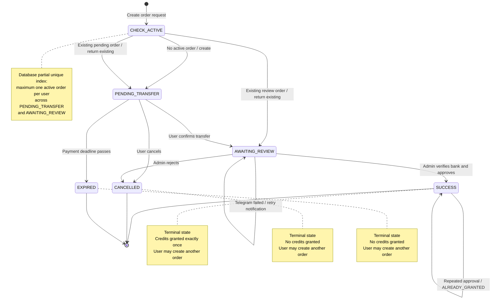

# Agent guidance

For UI work, read `.agent/design-system/nhuthungfoto/MASTER.md`.

# Payments state machine

```mermaid
stateDiagram-v2
    [*] --> CHECK_ACTIVE: Create order request

    state CHECK_ACTIVE <<choice>>
    CHECK_ACTIVE --> PENDING_TRANSFER: No active order / create
    CHECK_ACTIVE --> PENDING_TRANSFER: Existing pending order / return existing
    CHECK_ACTIVE --> AWAITING_REVIEW: Existing review order / return existing

    note right of CHECK_ACTIVE
        Database partial unique index:
        maximum one active order per user
        across PENDING_TRANSFER
        and AWAITING_REVIEW
    end note

    PENDING_TRANSFER --> AWAITING_REVIEW: User confirms transfer
    PENDING_TRANSFER --> CANCELLED: User cancels
    PENDING_TRANSFER --> EXPIRED: Payment deadline passes

    AWAITING_REVIEW --> AWAITING_REVIEW: Telegram failed / retry notification
    AWAITING_REVIEW --> SUCCESS: Admin verifies bank and approves
    AWAITING_REVIEW --> CANCELLED: Admin rejects

    SUCCESS --> SUCCESS: Repeated approval / ALREADY_GRANTED

    SUCCESS --> [*]
    CANCELLED --> [*]
    EXPIRED --> [*]

    note right of SUCCESS
        Terminal state
        Credits granted exactly once
        User may create another order
    end note

    note right of CANCELLED
        Terminal state
        No credits granted
        User may create another order
    end note

    note right of EXPIRED
        Terminal state
        No credits granted
        User may create another order
    end note
```
