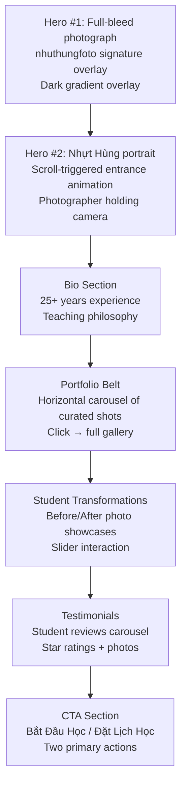
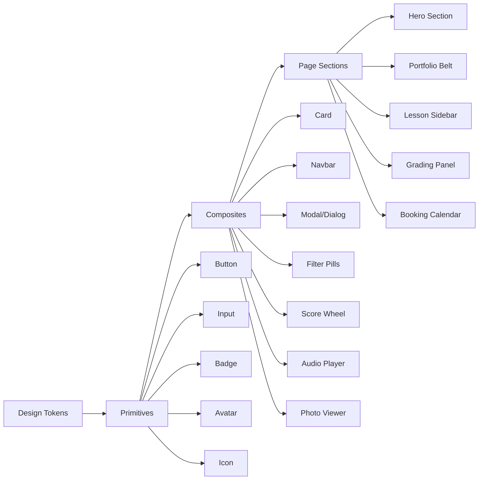

# nhuthungfoto — UI/UX Design Specification

> **Project:** nhuthungfoto Photography Education Platform
> **Generated:** March 13, 2026
> **Design System:** Persisted at [.agent/design-system/nhuthungfoto/MASTER.md](file:///Users/khoilam/Projects/nhuthungfoto-site/.agent/design-system/nhuthungfoto/MASTER.md)
> **Stack:** React + Vite + Tailwind CSS + shadcn/ui

---

## Table of Contents

1. [Design Philosophy](#1-design-philosophy)
2. [Design System](#2-design-system)
3. [Page Layouts & Mockups](#3-page-layouts--mockups)
4. [Component Library](#4-component-library)
5. [Motion & Interaction Design](#5-motion--interaction-design)
6. [Responsive Strategy](#6-responsive-strategy)
7. [Accessibility](#7-accessibility)
8. [Implementation Notes](#8-implementation-notes)

---

## 1. Design Philosophy

### Core Principles

| Principle | Description |
|-----------|-------------|
| **Photos are the star** | Every design decision serves the photography. Neutral backgrounds, minimal chrome, let images breathe |
| **Beginner-friendly** | NOT the typical "artsy photographer portfolio." Clean, intuitive, accessible to everyone |
| **Motion-driven storytelling** | Scroll-triggered animations, parallax, smooth transitions create an immersive narrative |
| **Vietnamese-first** | Typography, content, and UX optimized for Vietnamese users with Be Vietnam Pro font |
| **Trust through premium feel** | Professional design earns trust for paid courses and premium reviews |

### Design Style: Motion-Driven + Portfolio Grid

The UI merges two patterns:
- **Motion-Driven**: Animation-heavy, scroll effects, parallax (3–5 layers), entrance animations, page transitions — perfect for portfolio storytelling
- **Portfolio Grid with Lightbox**: Visuals first, hover overlays, immersive full-bleed gallery — photography demands center stage

### Anti-Patterns (Never Do This)

- ❌ Heavy text blocks — photography speaks louder than words
- ❌ Poor image showcase — never compress, crop randomly, or use grids that feel cluttered
- ❌ Emojis as icons — always use SVG (Lucide icons)
- ❌ Layout-shifting hovers — no scale transforms that push content
- ❌ Instant state changes — always transition (150–300ms)
- ❌ Invisible focus states — keyboard navigation must be visible

---

## 2. Design System

### Color Palette

| Role | Hex | Tailwind | Usage |
|------|-----|----------|-------|
| **Primary** | `#18181B` | `zinc-900` | Headlines, navbar, primary text |
| **Secondary** | `#3F3F46` | `zinc-700` | Body text, secondary elements |
| **CTA / Accent** | `#2563EB` | `blue-600` | Buttons, links, active states, progress bars |
| **Background** | `#FAFAFA` | `zinc-50` | Page backgrounds, light sections |
| **Text** | `#09090B` | `zinc-950` | Primary text content |
| **Surface** | `#FFFFFF` | `white` | Cards, modals, elevated surfaces |
| **Muted** | `#71717A` | `zinc-500` | Placeholder text, secondary info |
| **Border** | `#E4E4E7` | `zinc-200` | Card borders, dividers |
| **Gallery Dark** | `#0A0A0B` | — | Portfolio gallery background (immersive mode) |
| **Premium Gold** | `#D97706` | `amber-600` | Nhựt Hùng premium review accent |

> [!TIP]
> The monochrome + blue accent palette ensures photographs remain the visual focal point. The neutral backdrop never competes with the photos.

### Dark Mode Variant (Gallery / Immersive)

| Role | Hex | Usage |
|------|-----|-------|
| Background | `#0A0A0B` | Gallery viewer, lightbox |
| Surface | `#18181B` | Cards on dark |
| Text | `#FAFAFA` | Primary text on dark |
| Muted Text | `#A1A1AA` | Secondary text on dark |
| Border | `#27272A` | Subtle borders on dark |

### Typography

| Role | Font | Weights | Usage |
|------|------|---------|-------|
| **Headings** | Be Vietnam Pro | 500, 600, 700 | Page titles, section headings, hero text |
| **Body** | Noto Sans | 300, 400, 500 | Paragraphs, descriptions, UI labels |
| **Signature** | Custom (handwritten SVG) | — | nhuthungfoto brand mark |

**Why Be Vietnam Pro + Noto Sans?**
- Perfect Vietnamese diacritical mark support
- Clean, modern feel that doesn't overwhelm photos
- International readability for future English localization
- Both are Google Fonts — zero cost, fast CDN delivery

```css
@import url('https://fonts.googleapis.com/css2?family=Be+Vietnam+Pro:wght@300;400;500;600;700&family=Noto+Sans:wght@300;400;500;600;700&display=swap');
```

**Tailwind Config:**
```js
fontFamily: {
  heading: ['Be Vietnam Pro', 'sans-serif'],
  body: ['Noto Sans', 'sans-serif'],
}
```

### Type Scale

| Level | Size | Weight | Line Height | Usage |
|-------|------|--------|-------------|-------|
| Display | 48–72px | 700 | 1.1 | Hero headings |
| H1 | 36–48px | 700 | 1.2 | Page titles |
| H2 | 28–32px | 600 | 1.3 | Section headings |
| H3 | 22–24px | 600 | 1.4 | Card titles, subsections |
| H4 | 18–20px | 500 | 1.4 | Labels, small headings |
| Body Large | 18px | 400 | 1.6 | Hero descriptions |
| Body | 16px | 400 | 1.6 | Standard content |
| Body Small | 14px | 400 | 1.5 | Captions, meta data |
| Caption | 12px | 500 | 1.4 | Labels, badges, counters |

### Spacing Tokens

| Token | Value | Tailwind | Usage |
|-------|-------|----------|-------|
| `xs` | 4px | `p-1` | Tight gaps, icon spacing |
| `sm` | 8px | `p-2` | Inline spacing, badge padding |
| [md](file:///Users/khoilam/Projects/nhuthungfoto-site/prd-nhuthungfoto-final.md) | 16px | `p-4` | Standard padding |
| `lg` | 24px | `p-6` | Card padding, section gaps |
| `xl` | 32px | `p-8` | Large gaps |
| `2xl` | 48px | `p-12` | Section margins |
| `3xl` | 64px | `p-16` | Hero padding |
| `4xl` | 96px | `p-24` | Section separators |

### Shadow System

| Level | Value | Usage |
|-------|-------|-------|
| `sm` | `0 1px 2px rgba(0,0,0,0.05)` | Subtle lift (inputs, badges) |
| [md](file:///Users/khoilam/Projects/nhuthungfoto-site/prd-nhuthungfoto-final.md) | `0 4px 6px rgba(0,0,0,0.1)` | Cards, buttons |
| `lg` | `0 10px 15px rgba(0,0,0,0.1)` | Elevated cards, modals |
| `xl` | `0 20px 25px rgba(0,0,0,0.15)` | Hero images, featured content |
| `glow` | `0 0 20px rgba(37,99,235,0.15)` | CTA buttons on hover |

### Border Radius

| Token | Value | Usage |
|-------|-------|-------|
| `sm` | `6px` | Badges, small pills |
| [md](file:///Users/khoilam/Projects/nhuthungfoto-site/prd-nhuthungfoto-final.md) | `8px` | Buttons, inputs |
| `lg` | `12px` | Cards |
| `xl` | `16px` | Modals, large containers |
| `full` | `9999px` | Avatars, circular badges |

---

## 3. Page Layouts & Mockups

### 3.1 Landing / Hero Page (Phase 1)

````carousel

<!-- slide -->

````

**Section Flow (Scroll-Triggered Storytelling):**



**Hero #1 — Specifications:**

| Element | Specification |
|---------|---------------|
| **Background** | Full-bleed best photograph, `object-fit: cover`, `100vh` |
| **Overlay** | Linear gradient: `rgba(0,0,0,0.3)` top + `rgba(0,0,0,0.5)` bottom |
| **Signature** | SVG handwritten logo, centered, `max-width: 400px`, white |
| **Subtext** | "Nhiếp ảnh gia • Giảng viên • 25+ năm kinh nghiệm" — `text-lg`, `text-white/80` |
| **CTA** | "Khám Phá Tác Phẩm" → scrolls to portfolio belt |
| **Scroll indicator** | Animated chevron-down at bottom center |

**Hero #2 — Scroll-Triggered Animation:**

| Element | Specification |
|---------|---------------|
| **Trigger** | Intersection Observer at 30% viewport |
| **Animation** | `translateX(-100px)` → `translateX(0)`, `opacity: 0` → `opacity: 1` |
| **Duration** | 800ms ease-out |
| **Content** | Photo of Nhựt Hùng with camera, bio text, teaching credentials |

**Floating Navbar:**

| Element | Specification |
|---------|---------------|
| **Position** | `fixed`, `top-4 left-4 right-4` (floating) |
| **Background** | `rgba(255,255,255,0.85)` + `backdrop-filter: blur(12px)` |
| **Border** | `1px solid rgba(228,228,231,0.5)` |
| **Border radius** | `16px` |
| **Shadow** | `shadow-lg` |
| **Links** | Trang chủ, Tác phẩm, Khóa học, Đặt lịch, Đăng nhập |
| **CTA** | "Bắt Đầu Học" — blue-600 pill button |
| **Mobile** | Hamburger menu → slide-in drawer |
| **Scroll behavior** | Transparent on hero → solid on scroll |

**Portfolio Belt / Carousel:**

| Element | Specification |
|---------|---------------|
| **Layout** | Horizontal scroll, `overflow-x: auto`, `snap-x` |
| **Photos** | 4–6 curated shots, `aspect-ratio: 3/2`, `border-radius: 12px` |
| **Hover** | Scale 1.02, shadow elevation, category label appears |
| **CTA** | "Xem Tất Cả →" link to full gallery |
| **Animation** | Entrance: staggered fade-in from bottom |

---

### 3.2 Portfolio Gallery (Phase 1)


**Key Design Decisions:**

> [!IMPORTANT]
> This is NOT a typical masonry grid. It's an **immersive, one-photo-at-a-time lightbox viewer** — like walking through an art gallery. The photo IS the entire experience.

| Element | Specification |
|---------|---------------|
| **Background** | `#0A0A0B` — pure dark for maximum photo contrast |
| **Photo display** | Centered, `max-height: 85vh`, `max-width: 90vw`, `object-fit: contain` |
| **Navigation** | Left/right arrow buttons (Lucide `ChevronLeft`/`ChevronRight`), `48px touch targets` |
| **Keyboard** | Arrow keys for prev/next, Escape to close |
| **Category filters** | Top-center pills: Tất cả, Studio, Cưới, Sự kiện, Đường phố |
| **Counter** | Bottom-center: "3 / 24" — current position / total |
| **Transition** | Crossfade between photos, 400ms ease |
| **Mobile gesture** | Swipe left/right for navigation |
| **Filter pills** | Outline variant on dark bg: `border-white/30`, active: `bg-white text-black` |
| **Loading** | Skeleton shimmer placeholder while next image loads |

---

### 3.3 Learning Dashboard (Phase 2)


**Layout: Three-Column (Desktop)**

```
┌─────────────┬──────────────────────┬────────────┐
│  Sidebar    │     Main Content     │  Progress  │
│  (280px)    │     (flexible)       │  (300px)   │
│             │                      │            │
│  Module     │  Video Player        │  Credits   │
│  List       │  ─────────────       │  Balance   │
│  ├─ Lesson  │                      │            │
│  ├─ Lesson  │  Description         │  Streak    │
│  ├─ Lesson  │                      │  Counter   │
│  └─ ...     │  Quiz / Assignment   │            │
│             │  Submit Button       │  AI Scores │
│             │                      │  History   │
└─────────────┴──────────────────────┴────────────┘
```

**Left Sidebar — Module Navigation:**

| Element | Specification |
|---------|---------------|
| **Background** | `white`, `border-right: 1px solid zinc-200` |
| **Module title** | `text-lg font-semibold`, with track icon |
| **Lesson items** | List with checkmark (completed) / circle (pending) / dot (current) indicators |
| **Current lesson** | Blue-600 left border accent, `bg-blue-50` |
| **Completed** | Green checkmark icon, `text-zinc-500` |
| **Collapsed** | Mobile: drawer; Tablet: collapsed to icons only |

**Main Content Area:**

| Element | Specification |
|---------|---------------|
| **Video player** | 16:9 aspect ratio, rounded `lg`, shadow-md, custom play/pause controls |
| **Lesson title** | H2, Be Vietnam Pro, 600 weight |
| **Description** | Body text, Noto Sans, `text-zinc-700` |
| **Quiz section** | Card with `bg-white`, shadow-sm, radio buttons for multiple choice |
| **Submit button** | Full-width blue CTA: "Gửi Đáp Án" |
| **Assignment upload** | Drag-and-drop zone with camera icon, "Tải ảnh lên" text |

**Right Sidebar — Progress:**

| Element | Specification |
|---------|---------------|
| **User profile** | Avatar (40px) + name + skill level badge |
| **Progress bar** | Linear, blue-600, percentage label |
| **Credit balance** | Large number display (e.g. "10"), coin icon, `text-2xl font-bold` |
| **Streak counter** | Fire icon (SVG, not emoji!), day count, calendar dots |
| **AI scores** | Recent scores list: lesson name + score badge (colored by grade) |
| **Collapsed** | Mobile: horizontal swipeable cards at bottom |

---

### 3.4 Dual Grading View (Phase 2)


**Layout: Stacked Cards (Mobile-First) / Side-by-Side (Desktop)**

**AI Review Card:**

| Element | Specification |
|---------|---------------|
| **Header** | "Đánh Giá AI" with lightning-bolt icon, "Tức thì" badge |
| **Score wheel** | Circular progress: score/100, animated count-up on entrance |
| **Categories** | Horizontal bar charts: Bố cục, Ánh sáng, Lấy nét, Màu sắc, Kỹ thuật |
| **Strengths** | Green checkmark list |
| **Improvements** | Amber warning list |
| **Exercises** | Suggested next exercises, link to relevant lessons |
| **Cost badge** | "1 tín chỉ" — blue outlined badge, bottom of card |
| **Accent** | `blue-600` borders and highlights |

**Nhựt Hùng Review Card (Premium):**

| Element | Specification |
|---------|---------------|
| **Header** | "Đánh Giá từ Nhựt Hùng" with star icon, "Premium" gold badge |
| **Annotation viewer** | Photo with SVG overlay lines: composition guides, crop suggestions |
| **Written feedback** | Rich text block with Nhựt Hùng's avatar, chat-bubble style |
| **Voice message** | Custom audio player: play/pause, waveform visualization, duration |
| **Improvement roadmap** | Ordered steps with icons |
| **Cost badge** | "2 tín chỉ" — amber/gold outlined badge |
| **Accent** | `amber-600` borders and highlights |
| **Status states** | Pending (queue position), In-review (animated dots), Complete |

---

### 3.5 Booking Page (Phase 3)


**Layout:**

```
┌──────────────────────────┬──────────────────┐
│    Session Type Cards    │  Instructor      │
│    [Online] [In-Person]  │  Profile Card    │
├──────────────────────────┤                  │
│    Calendar + Time Slots │  Availability    │
│                          │  Rating + Stats  │
├──────────────────────────┤                  │
│    Photo Upload Area     │                  │
├──────────────────────────┴──────────────────┤
│    Payment + Confirm CTA                    │
│    [VietQR] [Momo]                          │
└─────────────────────────────────────────────┘
```

**Session Type Cards:**

| Element | Specification |
|---------|---------------|
| **Online card** | Google Meet icon (SVG), "30 phút" / "60 phút" toggle, blue accent |
| **In-person card** | Map pin icon, "Tại Việt Nam", amber accent |
| **Selection** | Ring border highlight + checkmark on selected |
| **Radio behavior** | Only one can be selected at a time |

**Calendar Widget:**

| Element | Specification |
|---------|---------------|
| **Style** | shadcn Calendar component, customized |
| **Available dates** | Blue-50 background, blue-600 text |
| **Selected date** | Blue-600 background, white text |
| **Unavailable** | `text-zinc-300`, not clickable |
| **Time slots** | Grid of pill buttons below calendar, selected = blue filled |

**Instructor Card:**

| Element | Specification |
|---------|---------------|
| **Photo** | 96px circle avatar, border-2 border-zinc-200 |
| **Name** | "Nhựt Hùng" — H3, font-semibold |
| **Credentials** | "25+ năm kinh nghiệm" — text-sm, zinc-500 |
| **Rating** | Star icons (filled) + rating number |
| **Availability** | Live counter: "3 chỗ trống hôm nay" — green badge |

---

## 4. Component Library

### Component Overview



### shadcn/ui Components to Use

| Component | Usage | Customization |
|-----------|-------|---------------|
| `Button` | CTAs, form submits | Blue-600 primary, zinc-900 secondary |
| `Card` | Content containers | White surface, shadow-md, rounded-lg |
| `Dialog` | Modals, confirmations | Blur backdrop, 16px radius |
| `Calendar` | Booking date picker | Blue accent for available/selected |
| `Avatar` | User profiles, instructor | Circle, border variant |
| `Badge` | Credits, status, scores | Blue/amber/green variants |
| `Input` | Forms, search | Zinc-200 border, zinc-900 focus |
| `Tabs` | Content switching | Underline variant for modules |
| `Progress` | Skill progress, loading | Blue-600 fill |
| `Carousel` | Portfolio belt, testimonials | Custom navigation controls |
| `Form` | With React Hook Form | shadcn Form pattern |
| `RadioGroup` | Session type selection | Card-style radio buttons |
| `Slider` | Before/after comparisons | Custom thumb, overlay |

### Custom Components to Build

| Component | Description |
|-----------|-------------|
| `PhotoViewer` | Full-screen immersive single-photo viewer with dark bg |
| `ScoreWheel` | Circular animated progress for AI scores (SVG-based) |
| `AudioPlayer` | Custom waveform player for voice feedback |
| `FilterPills` | Category filter horizontal scroll with active state |
| `AnnotationViewer` | Photo with SVG overlay composition lines |
| `CreditBadge` | Coin icon + credit count display |
| `BeforeAfter` | Draggable slider comparing two photos |
| `StreakCounter` | Day count with calendar dot visualization |

---

## 5. Motion & Interaction Design

### Animation Principles

| Principle | Implementation |
|-----------|---------------|
| **Purposeful** | Every animation communicates something; never purely decorative |
| **Fast** | 200–400ms for UI interactions, 600–800ms for entrance animations |
| **Interruptible** | User can scroll past animations; they don't block interaction |
| **Respectful** | `prefers-reduced-motion: reduce` disables all non-essential animation |

### Page-Level Animations

| Animation | Trigger | Duration | Easing |
|-----------|---------|----------|--------|
| Hero #2 entrance | Scroll to 30% viewport | 800ms | `ease-out` |
| Portfolio belt stagger | Section visible | 400ms + 100ms stagger per item | `ease-out` |
| Section fade-in | Intersection Observer at 20% | 600ms | `ease-out` |
| Testimonial carousel | Auto-advance every 5s | 400ms | `ease-in-out` |
| Navbar solidify | Scroll past hero | 200ms | `ease` |

### Component-Level Interactions

| Interaction | Animation | Duration |
|-------------|-----------|----------|
| Button hover | Background darken, subtle Y translate (-1px) | 200ms |
| Card hover | Shadow elevation (md → lg), Y translate (-2px) | 200ms |
| Portfolio photo hover | Subtle scale(1.02), caption overlay fade-in | 300ms |
| Gallery photo transition | Crossfade (opacity) | 400ms |
| Score wheel | Animated stroke-dashoffset on entrance | 1200ms |
| Credit count change | Animated number count-up/down | 600ms |
| Filter pill select | Background fill with spring animation | 250ms |
| Tab switch | Underline slide | 200ms |

### Parallax Layers (Hero)

| Layer | Speed | Content |
|-------|-------|---------|
| Background (far) | 0.3x | Full-bleed photograph |
| Overlay | 0.5x | Dark gradient |
| Signature | 0.7x | nhuthungfoto handwritten logo |
| Foreground (near) | 1.0x | CTA button + scroll indicator |

### Reduced Motion Alternative

```css
@media (prefers-reduced-motion: reduce) {
  *, *::before, *::after {
    animation-duration: 0.01ms !important;
    animation-iteration-count: 1 !important;
    transition-duration: 0.01ms !important;
    scroll-behavior: auto !important;
  }
}
```

---

## 6. Responsive Strategy

### Breakpoints

| Breakpoint | Width | Layout |
|------------|-------|--------|
| **Mobile** | 375px – 767px | Single column, bottom nav, hamburger menu |
| **Tablet** | 768px – 1023px | Two columns, collapsed sidebars |
| **Desktop** | 1024px – 1439px | Full layout, three columns (dashboard) |
| **Wide** | 1440px+ | Max-width container (1280px), centered |

### Mobile-Specific Adaptations

| Desktop Feature | Mobile Adaptation |
|-----------------|-------------------|
| Floating navbar | Fixed bottom tab bar (4 icons) + hamburger for more |
| Three-column dashboard | Stacked: Video → Quiz → Progress (horizontal swipe cards) |
| Side-by-side grading | Stacked: AI card on top → Nhựt Hùng card below |
| Calendar + sidebar | Full-width calendar → instructor card below |
| Portfolio arrows | Swipe gestures with subtle indicators |
| Filter pills | Horizontal scroll with overflow indicator |

### Container Strategy

```css
.container-main {
  max-width: 1280px;
  margin: 0 auto;
  padding: 0 16px; /* mobile */
}

@media (min-width: 768px) {
  .container-main { padding: 0 24px; }
}

@media (min-width: 1024px) {
  .container-main { padding: 0 32px; }
}
```

---

## 7. Accessibility

### Requirements

| Aspect | Specification |
|--------|---------------|
| **WCAG Level** | AA minimum (4.5:1 text contrast) |
| **Keyboard** | Full keyboard navigation, visible focus rings (`ring-2 ring-blue-600 ring-offset-2`) |
| **Screen readers** | Semantic HTML, ARIA labels for all interactive elements, skip-to-content link |
| **Motion** | `prefers-reduced-motion` respected, no auto-playing animations without user consent |
| **Images** | All photos have descriptive `alt` text in Vietnamese |
| **Forms** | All inputs have visible labels, error states use icon + text (not color alone) |
| **Touch targets** | Minimum 44×44px (48×48px recommended) |
| **Color** | Never color as the only indicator — always pair with icon or text |

### Focus Management

```css
/* Visible focus for keyboard users */
:focus-visible {
  outline: 2px solid #2563EB;
  outline-offset: 2px;
  border-radius: 4px;
}

/* No outline for mouse users */
:focus:not(:focus-visible) {
  outline: none;
}
```

---

## 8. Implementation Notes

### Tech Stack Mapping

| Design Element | Implementation |
|----------------|----------------|
| Scroll animations | Intersection Observer API (native) or Framer Motion |
| Parallax | CSS `transform: translate3d()` with scroll listener |
| Page transitions | Framer Motion `AnimatePresence` |
| Photo gallery | Custom `PhotoViewer` component with `preload` for adjacent images |
| Score wheel | SVG `<circle>` with animated `stroke-dashoffset` |
| Audio player | Web Audio API + custom waveform canvas |
| Calendar | shadcn Calendar + React Day Picker |
| Forms | React Hook Form + shadcn Form + Zod validation |
| Icons | Lucide React — consistent 24×24 viewBox |
| Image optimization | `` with WebP format, lazy loading via `loading="lazy"` |
| i18n | Vietnamese-first, structure ready for `next-intl` or similar |

### Framer Motion Presets

```tsx
// Entrance animation preset
const fadeInUp = {
  initial: { opacity: 0, y: 20 },
  animate: { opacity: 1, y: 0 },
  transition: { duration: 0.6, ease: 'easeOut' },
};

// Stagger children preset
const staggerContainer = {
  animate: { transition: { staggerChildren: 0.1 } },
};

// Gallery crossfade preset
const photoTransition = {
  initial: { opacity: 0 },
  animate: { opacity: 1 },
  exit: { opacity: 0 },
  transition: { duration: 0.4 },
};
```

### Image Strategy

| Context | Format | Sizing |
|---------|--------|--------|
| Hero background | WebP, `2560×1440` max | `srcset` with 1280, 1920, 2560 |
| Portfolio photos | WebP, original aspect ratio | `srcset` with 640, 1024, 1920 |
| Thumbnails (belt) | WebP, 3:2 aspect ratio | `400×267` |
| Assignment uploads | WebP conversion on server | Max 2048px longest edge |
| Avatars | WebP, 1:1 | `96×96`, `192×192` |

### Performance Targets

| Metric | Target |
|--------|--------|
| LCP (Largest Contentful Paint) | < 2.5s |
| FID (First Input Delay) | < 100ms |
| CLS (Cumulative Layout Shift) | < 0.1 |
| Total page weight (hero) | < 1.5MB |
| Time to Interactive | < 3s on 4G |

---

## Design System Files Reference

- **Master design system**: [MASTER.md](file:///Users/khoilam/Projects/nhuthungfoto-site/.agent/design-system/nhuthungfoto/MASTER.md) — Global source of truth
- **Page overrides**: `.agent/design-system/nhuthungfoto/pages/` — Per-page deviations
- **PRD**: [prd-nhuthungfoto-final.md](file:///Users/khoilam/Projects/nhuthungfoto-site/prd-nhuthungfoto-final.md) — Full product requirements

---

> [!NOTE]
> This design specification maps directly to the PRD's phased rollout:
> - **Phase 1** → Hero, Portfolio Gallery, Brand Page (sections 3.1, 3.2)
> - **Phase 2** → Learning Dashboard, Dual Grading (sections 3.3, 3.4)
> - **Phase 3** → Booking Page (section 3.5)
