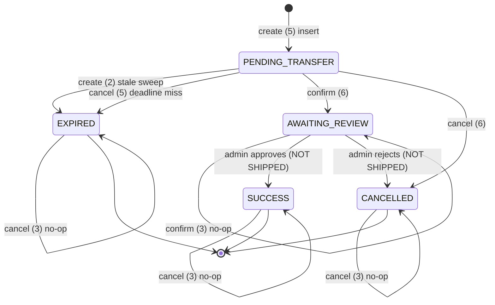

# Payments — state machine

> Source of truth: [`20260903000001_create_manual_payment_order.sql`](../../backend/supabase/migrations/20260903000001_create_manual_payment_order.sql),
> [`20260914000001_confirm_cancel_payment_order_rpc.sql`](../../backend/supabase/migrations/20260914000001_confirm_cancel_payment_order_rpc.sql)

## States

`order_status` enum:

| State | Kind | Meaning |
|---|---|---|
| `PENDING_TRANSFER` | active | created, waiting for the user to transfer (deadline: `expires_at`) |
| `AWAITING_REVIEW` | active | user claims the transfer was sent; admin must verify |
| `SUCCESS` | terminal | admin approved; credits granted exactly once |
| `CANCELLED` | terminal | user backed out, or admin rejected; no credits |
| `EXPIRED` | terminal | payment deadline passed; no credits |

**Invariants**

- At most **one active order per user** — enforced by the partial unique index
  `idx_payment_orders_active_user` (`UNIQUE (user_id) WHERE status IN ('PENDING_TRANSFER','AWAITING_REVIEW')`).
- `AWAITING_REVIEW` **never expires** — once the user has sent money, only an
  admin moves the order.
- Terminal states never re-enter the machine.

## Transitions (implemented)

Only **three RPCs** write `payment_orders`. Both columns below are required to
read the diagram: what moves the state, and where in the RPC it happens.

| # | From | To | RPC (step) | Trigger |
|---|---|---|---|---|
| 1 | — (none) | `PENDING_TRANSFER` | `create_manual_payment_order` (5) | insert new order |
| 2 | `PENDING_TRANSFER` | `EXPIRED` | `create_manual_payment_order` (2) | stale order, swept on the user's next create |
| 3 | `PENDING_TRANSFER` | `EXPIRED` | `cancel_manual_payment_order` (5) | user cancels after the deadline |
| 4 | `PENDING_TRANSFER` | `AWAITING_REVIEW` | `confirm_manual_payment_order` (6) | user claims the transfer was sent |
| 5 | `PENDING_TRANSFER` | `CANCELLED` | `cancel_manual_payment_order` (6) | user backs out in time |

## Non-transitions (no write, or 409)

| From | RPC (step) | Result |
|---|---|---|
| same `client_request_id`, any state | create (3) | return that row, no write |
| existing active order | create (4/6) | return it, no write |
| `AWAITING_REVIEW` | confirm (3) | idempotent no-op, return row |
| `SUCCESS`/`CANCELLED`/`EXPIRED` | cancel (3) | idempotent no-op, return row |
| `SUCCESS`/`CANCELLED`/`EXPIRED` | confirm (4) | **409**, no write |
| `AWAITING_REVIEW` | cancel (4) | **409**, no write |
| `PENDING_TRANSFER` past deadline | confirm (5) | **409**, no write (the raise aborts the txn) |

## Diagram

## Not shipped

`AWAITING_REVIEW` is currently **enter-only**: no RPC moves an order out of it.
The planned admin RPCs are `AWAITING_REVIEW → SUCCESS` (verify + grant credits
exactly once, writing a `payments` ledger row) and `AWAITING_REVIEW → CANCELLED`
(reject). Until then, a confirmed order parks forever.

## Why the deadline branch differs between confirm and cancel

Both detect "past deadline", but:

- **confirm** raises **409** and does **not** persist a flip — an uncaught
  `RAISE` aborts the transaction, so any `UPDATE status = 'EXPIRED'` before it
  would roll back.
- **cancel** materializes `EXPIRED` and **returns** — no `RAISE` follows, so the
  write commits.

Details: [rpc-reference.md](./rpc-reference.md). Rationale: [ADR-0001](../adr/0001-lazy-expiry.md).
