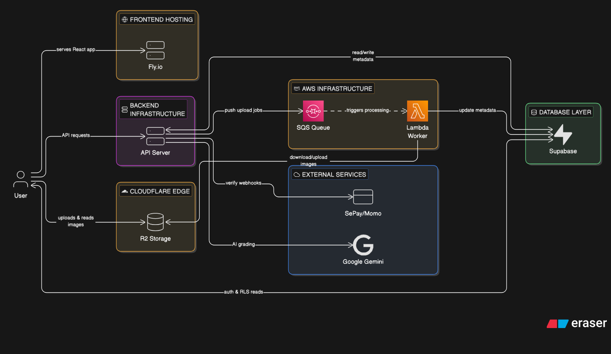
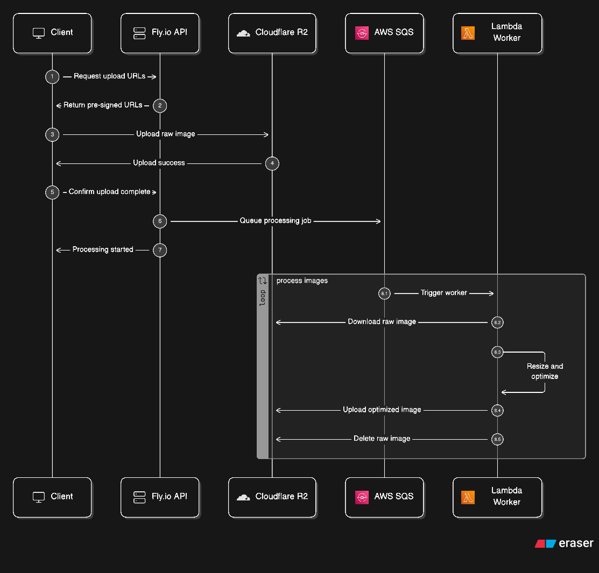

# Technical Design Document: nhuthungfoto

## 1. High-Level System Architecture



The nhuthungfoto platform follows a **Serverless-First** approach to minimize infrastructure overhead and maximize scalability for a single-founder operation.

### 1.1 Core Components

- **Client (React/Vite)**: Hosted on Vercel or Netlify. Uses **TanStack Query (React Query)** for server state management, caching, and data fetching. Communicates with the API and Supabase directly (limited).
- **Backend API (Hono on Cloudflare Workers)**: Serverless API on Cloudflare's Edge. Handles JSON-only traffic: auth orchestration, payments, crediting, pre-signed URL generation. Zero image bytes. Uses native R2 bindings for zero-latency storage access.
- **Image Processing Worker (AWS Lambda)**: Dedicated serverless function triggered natively by SQS. Runs `sharp` for image resizing, format conversion, watermarking, and EXIF preservation. Completely isolated from the API server.
- **Auth (Supabase Auth)**: Managed auth service with Google OAuth + email/password. Handles `auth.users` table, JWTs, and session management.
- **Database (Supabase)**: Persistent storage for users, courses, and submissions. Uses RLS for secure data access.
- **Object Storage (Cloudflare R2)**: S3-compatible API chosen for zero egress bandwidth fees. Globally distributed via Cloudflare's Edge.
- **Message Queue (AWS SQS)**: Decouples upload requests from image processing. Native Lambda trigger eliminates polling code.
- **AI Orchestrator**: Managed service within the backend that interacts with Gemini/GPT APIs for grading and content generation.
- **Integration Layer**: Calendly (Booking), SePay/Momo (Payments), Google Meet (Coaching).

### 1.2 Infrastructure & Hosting

| Component    | Service           | Region           | Free Tier                       | Vendor Lock-in             |
| ------------ | ----------------- | ---------------- | ------------------------------- | -------------------------- |
| Frontend     | **CF Pages**      | Global Edge      | Generous                        | Low (static export)        |
| Backend API  | **CF Workers**    | Global Edge      | 100K req/day (free), then $5/mo | Medium (workerd runtime)   |
| Image Worker | **AWS Lambda**    | `ap-southeast-1` | 1M invocations + 400K GB-sec/mo | Medium (handler signature) |
| Queue        | **AWS SQS**       | `ap-southeast-1` | 1M requests/mo                  | Low (standard SDK)         |
| Storage      | **Cloudflare R2** | Global Edge      | 10GB storage, 0 egress          | Low (S3-compatible API)    |
| Database     | **Supabase**      | `ap-southeast-1` | 500MB DB, 1GB storage           | Low (standard Postgres)    |

> **Design Rationale**: The API (Cloudflare Workers) and the Image Worker (Lambda) are fully separated to guarantee fault isolation. Workers was chosen for the API because it scales to zero, has zero cold starts (V8 isolates), and provides native R2 bindings for pre-signed URL generation. Lambda was chosen for image processing because of native SQS integration (zero polling code), generous RAM (up to 10GB) for `sharp` bursts, and $0 cost under the free tier.

### 1.3 Frontend Architecture & State Management

The frontend adheres to strict separation of concerns, heavily relying on **TanStack Query (React Query)** to handle all server state.

- **Server State vs Client State**: TanStack Query manages all async data (fetching, caching, loading/error states, cache invalidation). Local React `useState` is used exclusively for ephemeral, trivial UI state (e.g., dropdown toggles, modals).
- **Data Flow**: UI components are strictly stateless (no inline data fetching). Smart container components or custom hooks (e.g., `useModules()`) use `useQuery` and `useMutation` to interact with the backend API and pass strictly-typed data down to the presentation layer via props.
- **Caching & Optimistic Updates**: Features like browsing portfolios and courses leverage React Query's built-in caching (`stale-while-revalidate`) for instant navigation. Interactions like submitting photos or updating profiles use optimistic updates to make the app feel instantaneously responsive.

## 2. Database Schema (Supabase/PostgreSQL)

### 2.1 Core Types & Enums

- `skill_level`: `BEGINNER`, `INTERMEDIATE`, `ADVANCED`
- `specialty_track`: `PORTRAIT`, `STREET`, `TRAVEL`, `PRODUCT`
- `submission_status`: `UPLOADED`, `GRADING`, `AWAITING_HUNG`, `COMPLETED`, `FAILED`
- `review_type`: `AI`, `HUNG`
- `transaction_type`: `PURCHASE`, `SPEND`, `REFUND`, `STARTER_BONUS`
- `payment_status`: `PENDING`, `SUCCESS`, `EXPIRED`, `CANCELLED`

### 2.2 Table Definitions

#### `public.profiles` (Extends `auth.users`)

- `id`: `uuid` (PK, references `auth.users`)
- `full_name`: `text`
- `credits_balance`: `integer` (default: 0)
- `skill_level`: `skill_level` (default: `BEGINNER`)
- `phone_verified`: `boolean` (default: false, for 10-credit-bonus)
- `locale`: `text` (default: 'vi')
- `updated_at`: `timestamptz`
- **RLS**: Owner can read/update; others none.

#### `public.modules` (Flat Hierarchy)

- `id`: `uuid` (PK)
- `title`: `text`
- `slug`: `text` (unique)
- `description`: `text`
- `content_url`: `text` (video)
- `content_markdown`: `text`
- `level`: `skill_level`
- `track`: `specialty_track`
- `sequence_order`: `integer`
- `is_free`: `boolean` (default: true)
- **RLS**: Public read; Admin write.

#### `public.submissions`

- `id`: `uuid` (PK)
- `user_id`: `uuid` (FK to profiles)
- `module_id`: `uuid` (FK to modules)
- `original_photo_url`: `text`
- `processed_photo_url`: `text` (compressed for LLM)
- `status`: `submission_status`
- `review_type`: `review_type`
- `created_at`: `timestamptz`
- **RLS**: Owner can read/create; Admin can read/update.

#### `public.reviews`

- `id`: `uuid` (PK)
- `submission_id`: `uuid` (FK to submissions)
- `overall_score`: `integer` (1-100)
- `category_scores`: `jsonb` (e.g., `{"composition": 85, "lighting": 70}`)
- `ai_feedback`: `text`
- `hung_comments`: `text` (nullable)
- `annotation_data`: `jsonb` (nullable, coordinates for SVG overlays)
- `audio_url`: `text` (nullable, for Hung's voice note)
- **RLS**: Owner can read; Admin write.

#### `public.credit_history` (Audit Log)

- `id`: `uuid` (PK)
- `user_id`: `uuid` (FK to profiles)
- `amount`: `integer` (can be negative)
- `type`: `transaction_type`
- `metadata`: `jsonb` (nullable, ref_id to payments or submissions)
- `created_at`: `timestamptz`
- **RLS**: Owner read-only.

#### `public.payments` (Webhook Sink)

- `id`: `uuid` (PK)
- `user_id`: `uuid` (FK to profiles)
- `amount`: `bigint`
- `provider`: `text` ('MOMO', 'VIETQR')
- `status`: `payment_status`
- `external_ref`: `text` (unique provider ID)
- `raw_payload`: `jsonb`
- `created_at`: `timestamptz`
- **RLS**: Owner read-only (for order history).

#### `public.bookings` (Calendly Sync)

- `id`: `uuid` (PK)
- `user_id`: `uuid` (FK to profiles)
- `calendly_event_id`: `text` (unique)
- `session_time`: `timestamptz`
- `session_type`: `text` ('ONLINE', 'INPERSON')
- `status`: `text`
- **RLS**: Owner can read; Admin write.

### 2.3 Key Indexes

- `idx_profiles_user_id`
- `idx_submissions_user_id`
- `idx_submissions_status`
- `idx_payments_external_ref`
- `idx_credit_history_user_id`

## 3. AI Grading Engine & Cost Optimization

### 3.1 Image Handling & Pre-Processing

To maximize precision while minimizing costs and latency, the backend will perform the following steps before an LLM call:

- **Resizing**: Downscale images to a maximum dimension of `1024px` (preserving aspect ratio). This is the "sweet spot" for most vision models to detect detail without unnecessary token bloat.
- **Conversion**: Convert all images to `WebP` (quality: 80) to reduce payload size.
- **Metadata Extraction**: Use `exifr` to pull EXIF data (Aperture, Shutter Speed, ISO, Focal Length). This data is passed as a string in the prompt to provide the LLM with technical context it might otherwise misread.

### 3.2 Prompting Strategy

- **Persona**: "A professional yet highly encouraging photography mentor with 25+ years of experience. Focus on technical growth while maintaining an approachable tone."
- **Output Format**: Enforced **Structured JSON** for reliable parsing.
  ```json
  {
    "overall_score": 85,
    "categories": {
      "composition": { "score": 90, "feedback": "..." },
      "lighting": { "score": 70, "feedback": "..." },
      "focus": { "score": 95, "feedback": "..." },
      "color": { "score": 80, "feedback": "..." }
    },
    "summary": "Great shot! Consider the rule of thirds...",
    "suggested_exercises": ["Try a lower angle", "Watch the highlights"],
    "technical_analysis": "Excellent use of f/1.8 for bokeh..."
  }
  ```
- **Language**: Standard prompt is in English for quality, with a final instruction to "Output all feedback fields in Vietnamese."

### 3.3 Model Selection & Fallback

1.  **Primary**: `gemini-1.5-flash` (Highest cost-efficiency for vision tasks).
2.  **Fallback**: `gpt-4o-mini` (Triggered on API timeout, rate limits, or specific error codes).
3.  **Circuit Breaker**: If both fail, move submission to `FAILED` and notify admin/refund user.

### 3.4 Operational Optimization

- **Lazy Grading**: Grading only triggers _after_ the `credit_history` transaction is successful.
- **Prompt Caching**: Use static base prompts with dynamic "Assignment Context" to take advantage of model cost reductions for cached input.
- **Failure Handling**: Automate "Refund on Failure" for AI grading by rolling back or reversing the credit spend if the LLM fails after multiple retries.

## 4. Credit Logic & Atomic Transactions

### 4.1 Atomic Spend Function

To prevent double-spending or negative balances, all credit subtractions MUST use a single PostgreSQL query with a range check:

```sql
UPDATE public.profiles
SET credits_balance = credits_balance - :amount,
    updated_at = NOW()
WHERE id = :user_id AND credits_balance >= :amount
RETURNING credits_balance;
```

If `affected_rows == 0`, the transaction fails (insufficient balance).

### 4.2 Audit Guarantee

Every transaction (Spend, Purchase, Refund, Bonus) must follow a **Two-Step Atomic Pattern** using Supabase/Postgres Functions (`rpc`):

1.  Update `profiles.credits_balance`.
2.  Insert a row into `credit_history` with the exact change amount and reference ID (Submission ID or Payment ID).

### 4.3 Free Starter Credits

- Triggered exclusively on `phone_verified` boolean change from `false` → `true`.
- Prevents multiple bonus claims on a single account.

## 5. Payment Webhook Integration (VietQR/Momo)

### 5.1 Webhook Flow

1.  **Incoming Payload**: Webhook hits `POST /api/v1/webhooks/payments/:provider`.
2.  **Signature Verification**: Validate headers/tokens (e.g., SePay API Key or Momo Signature).
3.  **Deduplication**: Check `external_ref` against the `payments` table to prevent duplicate processing of the same transfer.
4.  **User Mapping**: Parse the payment message (e.g., "NHF1234") to extract the `user_short_id` or use a dedicated Virtual Account per user.

### 5.2 State Transitions

- **PENDING**: User initiates intent (Optional, since most bank transfers are push-based).
- **SUCCESS**: Verified webhook updates `payments` status and triggers the `credit_balance` increment.
- **IDEMPOTENCY**: The `external_ref` column has a `UNIQUE` constraint to ensure no payment is processed twice.

## 6. Image Processing Design

### 6.1 Blob Storage (Cloudflare R2)

- **Provider**: Cloudflare R2 chosen for performance and cost optimization.
- **Bucket Isolation**:
  - `uploads-raw/`: Temporary staging bucket for straight-out-of-camera JPEGs (up to 20MB).
  - `portfolio-public/`: Permanent bucket for processed, optimized images (WebP).

### 6.2 Pre-Signed URL & SQS Upload Flow (Load Analysis)



To minimize backend load, the system uses a **Pre-Signed URL + Queue** pattern for high-res photo uploads:

#### Write Path

1. **User Request**: Client requests pre-signed URLs from the backend.
   - _API Server Load_: Near zero. Generates pre-signed R2 URLs via AWS SDK and returns tiny JSON strings.
2. **Direct Upload**: Client uploads JPEGs (up to 20MB) directly to R2 `uploads-raw/` using the pre-signed URLs.
   - _Server Load_: None
   - _Client Load_: HTTP PUT stream (native).
3. **Queueing**: Client notifies the backend of completion. Backend pushes a job payload to queue.
4. **Async Processing**: Lambda reads the raw file from R2, processes it using `sharp` (downscales to max 2560px, WebP format, preserves EXIF data and color profiles), uploads the ~500KB result to `portfolio-public/`, and deletes the raw file from staging.
   - _Lambda Load_: Allocated 1GB RAM. Each invocation processes one image (~100MB peak). Scales automatically with SQS depth. Costs $0 under 400K GB-sec/mo free tier.

#### Read Path

5. **Client Fetching**: Portfolios and carousels request optimized images directly from R2 public URLs.
   - _API Server Load_: **0 bytes**. Client fetches directly from R2.
   - _R2 Load_: High volume, but completely handled globally by Cloudflare's Edge with zero egress costs.

#### Component Load Summary (100 DAU × 100 photos/day)

| Component     | Write Path Load                   | Read Path Load     | Monthly Cost       |
| ------------- | --------------------------------- | ------------------ | ------------------ |
| CF Workers    | ~0 (JSON only)                    | ~0 (not involved)  | $0 (free tier)     |
| Lambda Worker | ~100MB RAM per image, auto-scaled | N/A                | $0 (free tier)     |
| AWS SQS       | 900K requests/mo                  | N/A                | $0 (under 1M free) |
| Cloudflare R2 | 10K PUTs/day (raw + processed)    | ~50K GETs/day      | ~$15/mo storage    |
| User Browser  | 20MB × N uploads (native stream)  | ~250MB/day viewing | N/A                |

### 6.3 Security & Folder Structure

- **CORS**: Restrict direct R2 uploads/reads to the site's domain.
- **Pre-Signed URL TTL**: Upload URLs expire after 15 minutes.
- **Folder Structure (`portfolio-public/`)**:
  - `/submissions/:user_id/:submission_id/`
    - `original.jpg`: (If original preservation is desired).
    - `analysis.webp`: The optimized `1024px` version for the LLM.
    - `display.webp`: The optimized `2560px` version for 2K portfolio displays.

## 7. Submission Lifecycle (State Machine)

A photo submission transitions through the following states to ensure credit integrity and feedback quality:

1.  **IDLE**: User selects an assignment.
2.  **UPLOADING**: Client uploads source image directly to R2 via pre-signed URL; SQS job queued for Lambda processing.
3.  **PENDING_CREDIT**: Server validates user's `credits_balance`.
4.  **GRADING**: Credits deducted atomicly; LLM prompt sent to Gemini/GPT.
5.  **AWAITING_HUNG**: (Only if `review_type == 'HUNG'`) — Move to Hùng's manual review queue after AI grade is complete.
6.  **COMPLETED**: Final feedback (AI + human) available to user; notification sent.
7.  **FAILED**: Triggered by upload error, LLM timeout, or credit failure.
    - _Action_: Logs error and (if credits were deducted) initiates an automated refund.

## 8. Core API Endpoint Registry

_Note: On the frontend, all endpoints below are wrapped in custom TanStack Query hooks (e.g., `useModulesQuery()`, `useSubmitPhotoMutation()`) to abstract fetching logic, manage cache keys intelligently, and provide automated loading/error states to UI components._

### 8.1 Public / Auth

- `POST /v1/auth/signup`: Email + Phone (triggers 10-credit bonus).
- `POST /v1/auth/login`: Standard JWT / Supabase Auth.

### 8.2 Modules & Lessons

- `GET /v1/modules`: List all modules with level/track filters.
- `GET /v1/modules/:slug`: Get flat lesson list for a module.

### 8.3 Submissions & Credits

- `POST /v1/submissions`: Initiate a photo upload (returns R2 pre-signed upload URL).
- `POST /v1/submissions/:id/grade`: Trigger AI/Human grading flow.
- `GET /v1/submissions/me`: User's submission history and scores.
- `GET /v1/credits/balance`: Current balance and recent transactions.

### 8.4 Payments & Webhooks

- `POST /v1/payments/intent`: Prepare a purchase (returns VietQR/Momo payload).
- `POST /v1/webhooks/payments/sepay`: SePay/VietQR verification.
- `POST /v1/webhooks/payments/momo`: Momo IPN verification.

## 9. Booking & Calendly Integration

### 9.1 Technical Flow

1. **Selection**: User picks a coaching type on `nhuthungfoto-site`.
2. **Booking**: User is redirected to Calendly with pre-filled fields (`?email=[email]&name=[name]`).
3. **Webhook Sync**: Calendly hits our `POST /webhooks/calendly` endpoint on completion.
   - Backend verifies the email matches an existing user.
   - Backend creates a record in `public.bookings`.
4. **Completion**: User receives a "Session Confirmed" notification via the app dashboard.

## 10. Security, Validation & Rate Limiting

### 10.1 Request Validation

- **Zod**: All incoming payloads (Uploads, Missions, Profiles) are strictly validated against TS-generated Zod schemas.
- **Image Types**: `image/jpeg`, `image/png`, `image/webp` only. Max size limit direct to R2: 20MB (generous limit to perfectly support DSLR/Mirrorless users without forcing local compression).

### 10.2 Rate Limiting

- **Standard API**: 100 requests per 15 minutes per IP.
- **AI Grading**: 5 submissions per user per day (hard limit to control spend).
- **AI Missions**: 1 generation per user per 24-hour window.

## 11. Localization (i18n) Strategy

### 11.1 Backend Implementation

- Content in `public.modules` and `public.lessons` includes a `content_translations` JSONB column.
- Structure: `{ "en": { "title": "...", "content": "..." }, "vi": { ... } }`.
- Default query fetches the language matching the user's `profile.locale` or the `Accept-Language` header.

## 12. Daily AI Missions (Phase 3 Engagement)

### 12.1 Generation Logic

- **Cost**: Free (Text-only LLM call).
- **Model**: `gemini-1.5-flash`.
- **System Prompt**: "You are a creative photography director. Based on the user's city and level, generate a 15-minute 'Photography Mission'. It must be practical, fun, and achievable in public spaces."
- **Input**: User's `city` (string) + `skill_level`.
- **Output**: JSON containing `{ "title": "Street Shadows in Saigon", "steps": ["Find a narrow alley...", "..."] }`.
- **Engagement Loop**: Completion of a mission could grant a non-monetary "Badge" or "XP" in Phase 4.
